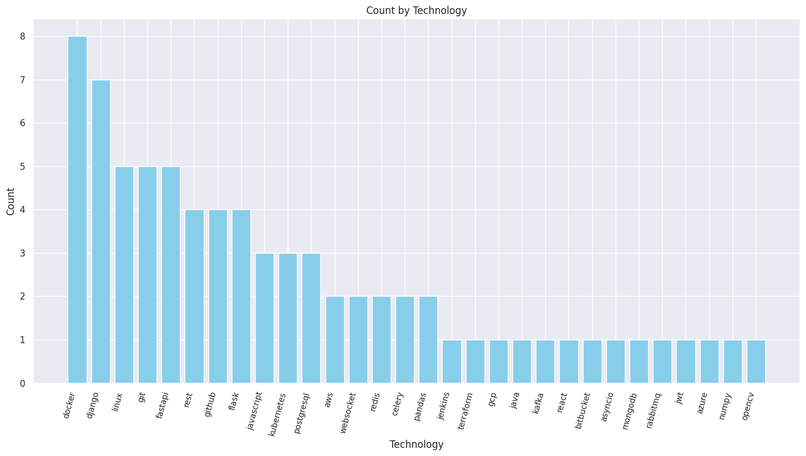

# Technology Trend Analysis

This project is designed to analyze job postings for Python developers,
identifying the most in-demand technologies in the industry. 
Using web scraping and data visualization, the project highlights technology
trends to provide valuable insights into the skills and tools that are most
requested by employers looking for Python developers.
## Table of Contents
- [Overview](#overview)
- [Project Structure](#project-structure)
- [Usage](#usage)
- [Features](#features)
- [Data Collection](#data-collection)
- [Visualization](#visualization)
- [License](#license)

---

## Overview
This project scrapes job postings from websites like **DOU.ua** using `Scrapy`, analyzes keywords and skills in Python, 
and generates visualizations of popular technologies using `Seaborn` and `Matplotlib`. The project is ideal for anyone 
looking to understand technology trends in the job market, particularly in the Python ecosystem.

## Project Structure
```
📁 python-trend-analysis/
├── 📂 job_stats/                  # Scrapy spiders for scraping job data
├── 📂 data/                     # Folder to store raw and cleaned CSV data
├── 📂 visualizations/           # Folder for saving generated graphs
├── 📄 main.py                   # Main script for running the analysis
├── 📄 requirements.txt          # Required libraries for the project
└── 📄 README.md                 # Project documentation
```

## Usage
1. Create and activate a virtual environment:

    For Unix systems:
    ```bash
    python -m venv env
    source venv/bin/activate
    ```

    For Windows systems:
    ```bash
    python -m venv env
    venv\Scripts\activate
    ```

2. Install the requirements:

    ```bash
    pip install -r requirements.txt
    ```

3. Run the main script to start scraping and analyzing data.
   ```bash
   python main.py
   ```

4. Visualizations of technologies will be saved in the `visualizations` folder.

## Features
- **Web Scraping**: Collects job data from popular site.
- **Data Processing**: Cleans and organizes job data.
- **Data Visualization**: Graph trends in technology demand.

## Data Collection
The `Scrapy` spider collects job posts from DOU.ua, storing them in a CSV file for analysis.

## Visualization
The project generates bar charts and trend lines showing the popularity of various technologies over time.

## License
This project is licensed under the MIT License.


